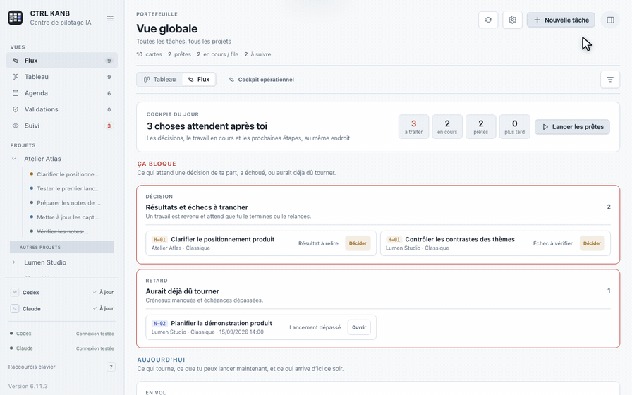
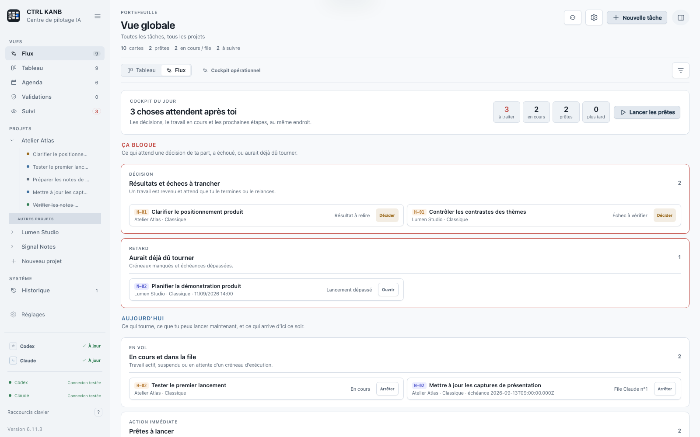
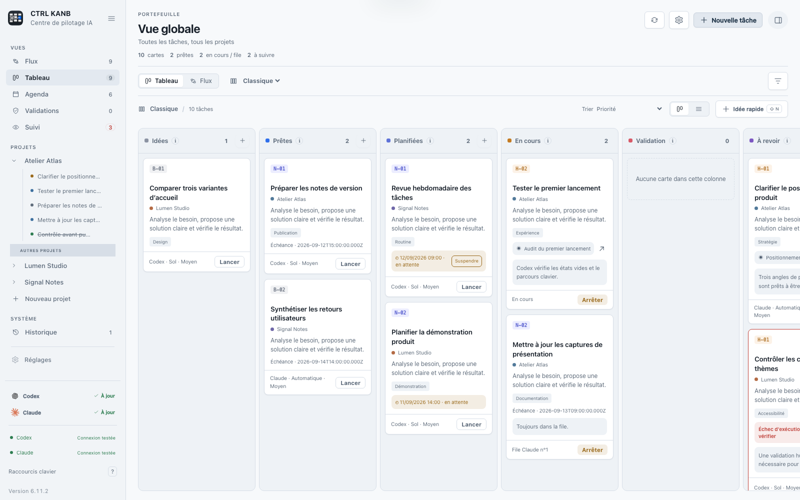
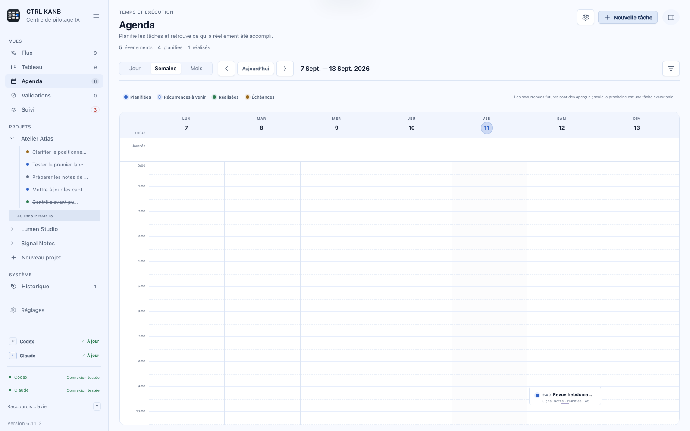
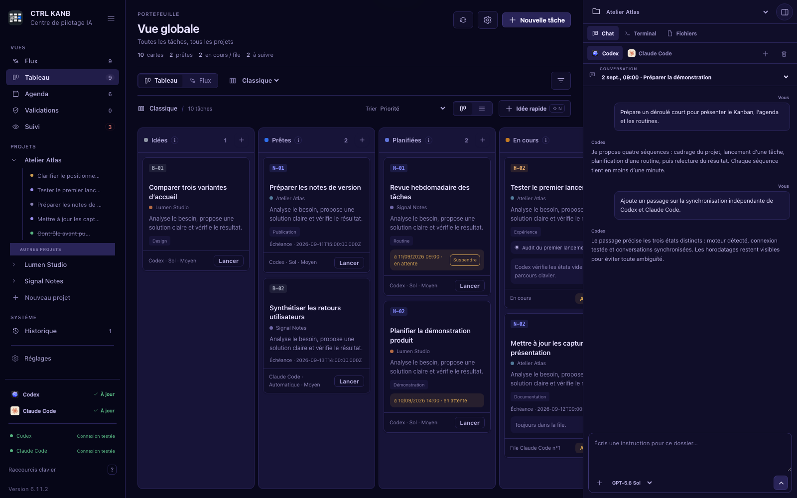

# CTRL KANB

[English](README.md) · **Français**


## Codex et Claude font le travail. CTRL KANB garde la trace de tout ce que vous leur avez confié.

Quand on utilise quotidiennement des agents de développement, le plus difficile n’est plus de leur faire réaliser une tâche. Il faut se souvenir de ce qui est en cours, de ce qui doit démarrer plus tard, de la conversation associée à chaque projet et des décisions qui attendent une réponse.

**CTRL KANB est l’espace local au-dessus des files d’attente : tâches, conversations, travail programmé, routines, validations et résultats au même endroit.**

[**Télécharger pour macOS**](https://github.com/CharlesVbT/ctrl-kanb/releases/latest) · [**Télécharger pour Windows**](https://github.com/CharlesVbT/ctrl-kanb/releases/latest) · [Documentation](#documentation)



**Créer → Programmer → Déléguer → Valider → Répéter**

Local · Codex + Claude · macOS + Windows · Apache 2.0

## Quand les files d’attente des agents ne suffisent plus

Codex et Claude savent accomplir des tâches complexes. Le suivi devient plus difficile lorsque le travail s’étend sur plusieurs projets et plusieurs jours :

- Claude attend une réponse dans une conversation ;
- Codex a terminé une tâche confiée la veille ;
- un autre travail doit commencer demain matin ;
- des contrôles doivent revenir chaque semaine ;
- le résultat doit encore être validé humainement.

CTRL KANB garde ce travail visible pendant que les agents l’exécutent. L’application est pensée pour piloter les tâches déléguées dans le temps, tout en laissant à l’utilisateur le contrôle des lancements, des autorisations et de la validation finale.

| Besoin | Emplacement dans CTRL KANB |
|---|---|
| Travail ponctuel confié à un agent | Tableau **Classique** |
| Travail quotidien, hebdomadaire ou mensuel | Tableau **Routines** |
| Tâches futures et échéances | **Agenda** |
| Travail actif ou en attente de décision | **Flux** et **Validations** |
| Travail terminé | **Suivi** et **Historique** |
| Contexte du projet | **Conversations**, chat, terminal et fichiers |

## Télécharger CTRL KANB

- **Applications prêtes à installer** : la [dernière release](https://github.com/CharlesVbT/ctrl-kanb/releases/latest) contient les paquets macOS et Windows, les notes de version et `SHA256SUMS.txt`.
- **macOS** : téléchargez `CTRL-KANB-<version>-macOS-arm64.zip`, décompressez-le puis ouvrez l’application.
- **Windows** : téléchargez `CTRL-KANB-<version>-Windows-x64-setup.exe` et lancez l’installateur NSIS.
- **Sources** : chaque release contient également les archives `.zip` et `.tar.gz` de la version correspondante.

Codex et Claude sont facultatifs. Installez et connectez uniquement les agents que vous souhaitez utiliser.

## L’application en action

Toutes les captures sont générées depuis un jeu fictif. Elles ne contiennent ni compte, ni conversation, ni chemin provenant d’un utilisateur réel.



| Tableau | Agenda |
|---|---|
|  |  |



## Fonctions principales

- projets associés à des dossiers locaux, avec épinglage et affichage progressif ;
- deux tableaux fixes : **Classique** pour les tâches ponctuelles et **Routines** pour les tâches récurrentes ;
- création rapide, détails avancés, dépendances, priorités et catégories ;
- agenda Jour, Semaine et Mois avec fuseau, premier jour de semaine et format 12/24 heures ;
- tâches manuelles, lancements programmés et récurrences quotidiennes, hebdomadaires ou mensuelles ;
- aperçu des occurrences futures sans dupliquer les cartes exécutables ;
- files et limites de concurrence séparées pour Codex et Claude ;
- sérialisation des consignes visant une même conversation ;
- validations humaines pour les commandes, modifications de fichiers et questions des agents ;
- historique, archivage réversible, restauration et suppression avec confirmation ;
- synchronisation datée et indépendante des conversations Codex et Claude ;
- chat avec choix du modèle, pièces jointes et conversations distinctes ;
- terminal local complet : zsh sur macOS, PowerShell sur Windows ;
- navigateur de fichiers confiné au dossier du projet ;
- notifications par catégorie et par tâche ;
- thèmes clairs et sombres, palettes et taille de police ;
- export JSON et restauration avec copie préalable de l’état courant ;
- palette de commandes avec `⌘ K` sur macOS ou `Ctrl K` sur Windows ;
- planificateur d’arrière-plan facultatif, désactivé au premier lancement.

## Compatibilité

| Élément | État |
|---|---|
| macOS | macOS 14 ou plus récent ; testé sur Apple Silicon ; outils Apple requis pour compiler |
| Windows | Windows 11 x64 validé ; installateur NSIS et WebView2 |
| Codex | facultatif ; nécessaire uniquement aux fonctions Codex |
| Claude | facultatif ; nécessite Claude Code CLI installé et authentifié localement |
| Hors connexion | Kanban, Agenda et données locales restent accessibles ; les agents et leur synchronisation nécessitent leurs services |

CTRL KANB fonctionne avec Codex seul, Claude seul, les deux, ou sans agent pour l’organisation locale. La présence d’un exécutable, l’authentification du compte et la fraîcheur de la synchronisation sont trois états distincts.

Les versions testées et les limites observées sont consignées dans [COMPATIBILITY.md](docs/COMPATIBILITY.md).

## Compiler depuis les sources

### Agents facultatifs

- [Codex CLI — documentation officielle](https://developers.openai.com/codex/cli)
- [Claude Code — installation officielle](https://docs.anthropic.com/en/docs/claude-code/getting-started)

CTRL KANB ne fournit aucun abonnement, quota ou identifiant pour ces services.

### macOS depuis les sources

```sh
git clone https://github.com/CharlesVbT/ctrl-kanb.git
cd ctrl-kanb
npm ci
npm run install:macos
```

Pour installer dans le compte courant :

```sh
CTRL_KANB_INSTALL_DIR="$HOME/Applications" npm run install:macos
```

### Windows depuis les sources

Avec Git, Node.js, Rust 1.88 ou plus récent avec MSVC, WebView2 et les outils C++ de Visual Studio :

```powershell
git clone https://github.com/CharlesVbT/ctrl-kanb.git
cd ctrl-kanb\Platforms\Windows
.\setup.ps1
.\build.ps1
```

L’installateur est créé sous `Platforms\Windows\src-tauri\target\release\bundle\nsis`.

Le guide détaillé couvre l’installation, les mises à jour et la suppression : [INSTALLATION.md](docs/INSTALLATION.md).

## Première configuration

1. Ajoutez un projet et choisissez son dossier.
2. Ouvrez **Réglages → Agents et modèles**.
3. Actualisez la détection, puis testez séparément Codex et/ou Claude.
4. Choisissez l’agent et les modèles proposés par défaut.
5. Créez une tâche dans **Classique** ou configurez une routine.

Les libellés ont un sens précis :

- **Disponible sur cet ordinateur** : l’exécutable a été trouvé ;
- **Connexion testée** : un aller-retour réel a réussi à la date affichée ;
- **Synchronisé** : les conversations liées ont été relues à la date affichée ;
- **Aucune session** : aucune conversation locale correspondante n’a été trouvée.

Un test de connexion ne garantit ni quota disponible, ni accès à tous les modèles. Une synchronisation ne teste pas l’authentification. Pour Claude, elle relit les sessions de Claude Code CLI sans envoyer de nouvelle consigne.

## Détection des agents

Au démarrage, CTRL KANB cherche séparément `codex` et `claude` dans les emplacements connus et le `PATH` transmis à l’application. Un lancement graphique peut recevoir un `PATH` différent de celui d’un terminal.

Pour une installation personnalisée, définissez un chemin absolu :

```text
CTRL_KANB_CODEX_PATH
CTRL_KANB_CLAUDE_PATH
```

Les anciens alias `CODEX_PATH` et `CLAUDE_PATH` restent reconnus. Les identifiants demeurent gérés par les outils officiels ; CTRL KANB ne copie ni jeton ni mot de passe dans son tableau.

L’exécution des tâches utilise les interfaces locales documentées par les fournisseurs : Codex App Server et le mode non interactif de Claude Code CLI. Lors de l’initialisation de Codex App Server, CTRL KANB s’identifie comme `ctrl-kanb`. L’application ne fournit pas l’accès à d’autres utilisateurs et ne revend pas de compte fournisseur. La synchronisation Claude relit seulement les sessions déjà présentes dans le profil local de l’utilisateur ; elle ne s’authentifie pas et n’envoie aucune consigne.

## Données et permissions

```text
macOS   ~/Library/Application Support/CTRL KANB/
Windows %LOCALAPPDATA%\CTRL KANB Data\
```

Ces données peuvent contenir consignes, réponses, chemins, identifiants de conversation et journaux. Un export JSON contient ces mêmes données et doit rester privé.

Le navigateur de fichiers reste dans le projet. Le terminal et les agents sont des processus locaux exécutés avec les droits du compte utilisateur et peuvent avoir un accès plus large selon leurs permissions. Le verrou protège la fenêtre ; il ne chiffre pas `board.json`.

Consultez [PRIVACY.md](PRIVACY.md) et [SECURITY.md](SECURITY.md).

## Documentation

| Document | Contenu |
|---|---|
| [Guide utilisateur](docs/USER-GUIDE.md) | projets, tâches, Agenda, routines, conversations et réglages |
| [Installation](docs/INSTALLATION.md) | prérequis, compilation, mise à jour et suppression |
| [Compatibilité](docs/COMPATIBILITY.md) | systèmes testés et limites observées |
| [Dépannage](docs/TROUBLESHOOTING.md) | agents, modèles, synchronisation, Agenda et terminal |
| [Architecture](docs/ARCHITECTURE.md) | hôtes, stockage, files, permissions et planificateur |
| [Organisation du dépôt](docs/REPOSITORY-STRUCTURE.md) | code partagé, macOS, Windows, tests et outils |
| [Modèle de données](docs/DATA-MODEL.md) | schéma persistant et migrations |
| [Version Windows](docs/WINDOWS-PORT.md) | implémentation et validation Tauri |
| [Contrôles de version](docs/RELEASE-CHECKLIST.md) | construction, validation et livraison des paquets |
| [Historique](CHANGELOG.md) | changements visibles par version |
| [Assistance](SUPPORT.md) | rapports de bugs et demandes d’évolution |

## Développement

```sh
npm ci
npm test
npm run build
```

Sous Windows :

```powershell
npm ci
npm run test:static
npm run test:ui
npm ci --prefix Platforms/Windows
cargo fmt --manifest-path Platforms/Windows/src-tauri/Cargo.toml --check
cargo clippy --manifest-path Platforms/Windows/src-tauri/Cargo.toml --all-targets -- -D warnings
cargo test --manifest-path Platforms/Windows/src-tauri/Cargo.toml
npm --prefix Platforms/Windows run build
```

Organisation du dépôt :

```text
Shared/Web/        interface, styles, traductions et adaptateur communs aux deux applications
Platforms/macOS/  hôte AppKit/WebKit, helper, CLI, ressources Apple et tests macOS
Platforms/Windows/ hôte Tauri/Rust, ressources Windows et scripts PowerShell
Tests/             contrôles transversaux de l’interface, du contrat Windows et de la confidentialité
Tools/             utilitaires de maintenance de la documentation
docs/              documentation utilisateur, technique et de publication
```

macOS et Windows sont deux plateformes de même niveau dans `Platforms/`. Le rôle précis de chaque dossier est décrit dans [Organisation du dépôt](docs/REPOSITORY-STRUCTURE.md).

Consultez [CONTRIBUTING.md](CONTRIBUTING.md) avant une modification.

## Limites connues

- l’ordinateur doit être allumé et la session ouverte pour une tâche programmée ;
- une validation active ne survit pas à l’arrêt du processus d’agent ;
- le terminal intégré est un shell complet, pas un bac à sable ;
- modèles, quotas et services dépendent du fournisseur ;
- WSL n’est pas pris en charge ;
- les essais prolongés veille/réveil et plusieurs échelles Windows restent à compléter.

## Origine du projet

CTRL KANB est né d’un problème concret. En utilisant régulièrement Codex et Claude, **Charles VbT** n’avait plus seulement besoin de faire réaliser une tâche : il lui fallait un moyen fiable de retrouver tout le travail confié à travers plusieurs projets, conversations, échéances et routines.

Il a façonné l’application pour son propre usage avec l’aide intensive de Codex et Claude, puis en a contrôlé l’interface, le fonctionnement, la sécurité et la confidentialité. Charles n’est pas développeur logiciel de métier et le projet assume clairement sa construction assistée par l’IA. L’application et sa documentation restent ouvertes à l’examen, aux tests et aux contributions.

## Indépendance et licence

CTRL KANB est indépendant et n’est ni affilié, ni validé, ni parrainé par OpenAI ou Anthropic. Les noms « Codex », « Claude » et « Claude Code CLI » servent uniquement à décrire la compatibilité et l’agent local choisi par l’utilisateur. CTRL KANB n’embarque aucun logo OpenAI ou Anthropic ; les icônes d’agents sont des symboles d’interface originaux et neutres. Voir [THIRD_PARTY_NOTICES.md](THIRD_PARTY_NOTICES.md).

CTRL KANB est imaginé et piloté par **Charles VbT**. Son code original et sa documentation sont distribués sous [Apache License 2.0](LICENSE). Les conditions d’attribution figurent dans [NOTICE](NOTICE).
