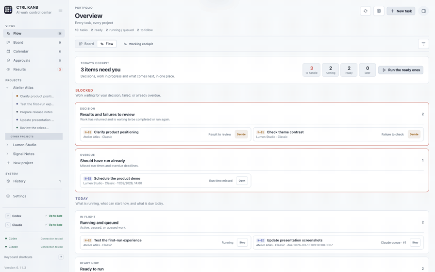
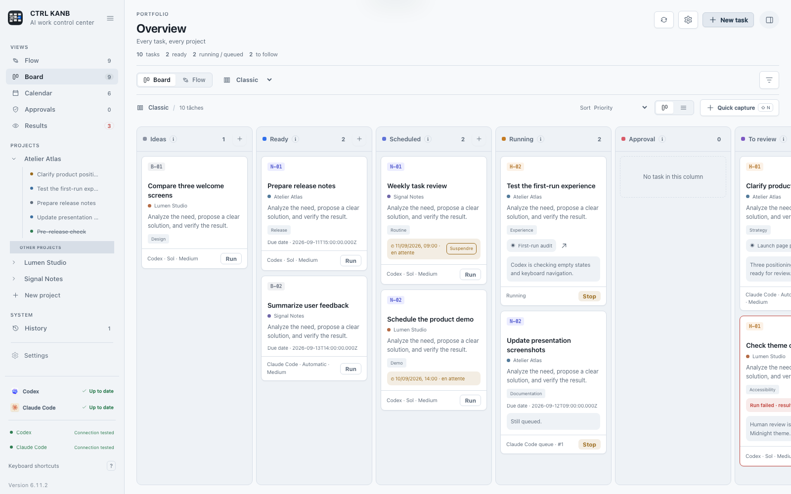
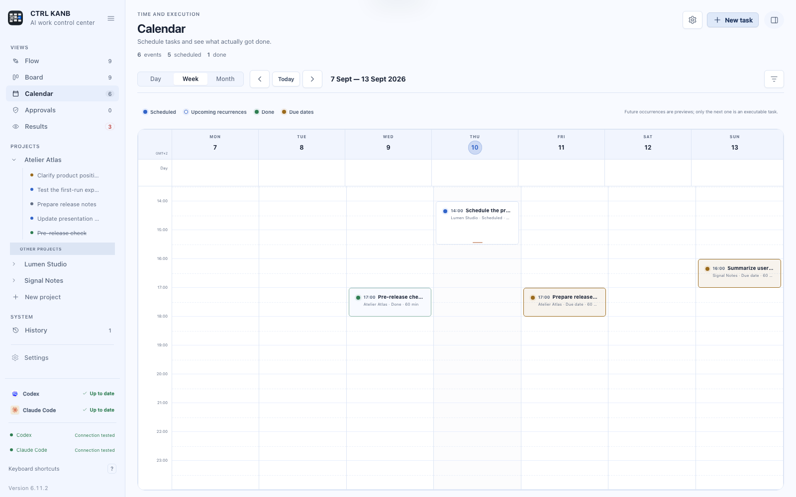
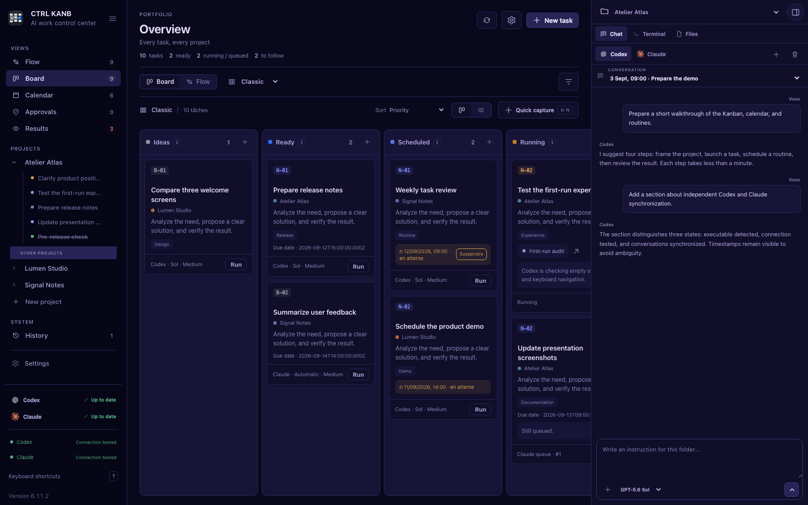

# CTRL KANB

**English** · [Français](README.fr.md)


## Codex and Claude do the work. CTRL KANB keeps track of everything you delegated.

When you use coding agents every day, the hard part is no longer getting one task done. It is remembering what is running, what should happen later, which conversation belongs to which project, and what is waiting for you.

**CTRL KANB is the local workspace above the queues: tasks, conversations, scheduled work, recurring routines, approvals, and results in one place.**

[**Download for macOS**](https://github.com/CharlesVbT/ctrl-kanb/releases/latest) · [**Download for Windows**](https://github.com/CharlesVbT/ctrl-kanb/releases/latest) · [Documentation](#documentation)



*Recorded in the real interface with fictional data: switch from Flow to Board, move a task, open the Calendar, then continue in the project chat.*

**Create → Schedule → Delegate → Review → Repeat**

Local-first · Codex + Claude · macOS + Windows · Apache 2.0

## When agent queues stop being enough

Codex and Claude can complete complex tasks. Their queues become harder to follow when work spans several projects and several days:

- Claude is waiting for an answer in one conversation;
- Codex finished something delegated yesterday;
- another task should start tomorrow morning;
- recurring checks must run every week;
- the result still needs human review.

CTRL KANB keeps that work visible while the agents execute it. It is designed around managing delegated work over time, with the user remaining in control of launches, permissions, and final validation.

| What you need to manage | Where it lives |
|---|---|
| One-off delegated work | **Classic** board |
| Daily, weekly, or monthly work | **Routines** board |
| Future tasks and deadlines | **Calendar** |
| Work running or waiting for you | **Flow** and **Approvals** |
| Completed work | **Results** and **History** |
| Project context | Linked **Conversations**, chat, terminal, and files |

## Download CTRL KANB

- **Ready-to-install applications:** the [latest release](https://github.com/CharlesVbT/ctrl-kanb/releases/latest) contains the macOS and Windows packages, release notes, and `SHA256SUMS.txt`.
- **macOS:** download `CTRL-KANB-<version>-macOS-arm64.zip`, extract it, and open the application.
- **Windows:** download `CTRL-KANB-<version>-Windows-x64-setup.exe` and run the NSIS installer.
- **Source archives:** every release also provides versioned `.zip` and `.tar.gz` archives.

Codex and Claude are optional. Install and sign in only to the agent CLIs you intend to use.

## The app in action

Every screenshot below is generated from a fictional presentation dataset. It contains no real account, conversation, project path, or user data.


| Board | Calendar |
|---|---|
|  |  |



## Main features

- local-folder projects with pinning and progressive task lists;
- two fixed workflows: **Classic** for one-off work and **Routines** for recurring work;
- quick capture plus advanced prompts, dependencies, priorities, and categories;
- Day, Week, and Month calendar views with configurable time zone, week start, and 12/24-hour time;
- manual tasks, scheduled runs, and daily, weekly, or monthly recurrence;
- future recurrence previews without duplicating executable cards;
- separate queues and concurrency limits for Codex and Claude;
- serialization of instructions targeting the same conversation;
- human approval flows for commands, file changes, and agent questions;
- history, reversible archives, restoration, and confirmed deletion;
- independent, timestamped Codex and Claude conversation sync;
- project chat with model selection, attachments, and multiple conversations;
- a full local shell: zsh on macOS and PowerShell on Windows;
- a file browser constrained to the project folder;
- notification rules by event and by task;
- light and dark themes, color palettes, and adjustable font size;
- JSON export and validated restore with a pre-import backup;
- a command palette with `⌘ K` on macOS or `Ctrl K` on Windows;
- an optional background scheduler, disabled by default.

## Compatibility

| Component | Current support |
|---|---|
| macOS | macOS 14 or later; tested on Apple Silicon; Apple Command Line Tools required to build |
| Windows | Windows 11 x64 tested; NSIS installer and WebView2 host |
| Codex | optional; required only for Codex features |
| Claude | optional; requires a locally installed and authenticated Claude Code CLI |
| Offline use | board, calendar, and local data remain available; agents and their sync require their services |

CTRL KANB works with Codex alone, Claude alone, both, or neither when used only for local organization. Executable detection, account authentication, and conversation sync freshness are displayed as separate states.

The exact versions tested and the remaining limitations are recorded in [COMPATIBILITY.md](docs/COMPATIBILITY.md). That detailed report is currently maintained in French.

## Build from source

### Optional agent CLIs

Install and sign in only to the agents you intend to use:

- [Codex CLI — official documentation](https://developers.openai.com/codex/cli)
- [Claude Code — official setup](https://docs.anthropic.com/en/docs/claude-code/getting-started)

CTRL KANB does not provide a subscription, quota, or credentials for either service.

### Build and install on macOS

```sh
git clone https://github.com/CharlesVbT/ctrl-kanb.git
cd ctrl-kanb
npm ci
npm run install:macos
```

The script builds the application, runs the installed checks, and installs it in `/Applications`. To install it for the current user instead:

```sh
CTRL_KANB_INSTALL_DIR="$HOME/Applications" npm run install:macos
```

### Build the Windows installer

Run this in PowerShell with Git, Node.js, Rust 1.88 or later using MSVC, WebView2, and the Visual Studio C++ build tools installed:

```powershell
git clone https://github.com/CharlesVbT/ctrl-kanb.git
cd ctrl-kanb\Platforms\Windows
.\setup.ps1
.\build.ps1
```

The installer is written under `Platforms\Windows\src-tauri\target\release\bundle\nsis`.

The complete installation, update, and removal instructions are in [INSTALLATION.md](docs/INSTALLATION.md).

## First setup

1. Add a project and select its local folder.
2. Open **Settings → Agents and models**.
3. Refresh detection, then test Codex and/or Claude independently.
4. Choose the default agent and models.
5. Create a task in **Classic** or configure a routine.

Status labels have distinct meanings:

- **Available on this computer** means the executable was found;
- **Connection tested** means a real round trip succeeded at the displayed time;
- **Synchronized** means linked conversations or local sessions were read at the displayed time;
- **No session** means no matching local conversation was found.

A successful connection test does not guarantee remaining quota or access to every model. Synchronization does not authenticate an account, and Claude sync reads local Claude Code CLI sessions and does not send a new prompt.

## Codex and Claude detection

At startup, CTRL KANB searches for `codex` and `claude` independently in known application locations, the `PATH` inherited by the app, and common user-level package locations. A graphical app may receive a different `PATH` from an interactive terminal.

For a custom installation, provide an absolute executable path:

```text
CTRL_KANB_CODEX_PATH
CTRL_KANB_CLAUDE_PATH
```

The older `CODEX_PATH` and `CLAUDE_PATH` aliases remain supported for compatibility. Credentials remain managed by the official CLIs; CTRL KANB does not copy tokens or passwords into its board.

Task execution uses the providers’ documented local interfaces: Codex App Server over its local protocol, and Claude Code CLI in non-interactive mode. CTRL KANB identifies itself as `ctrl-kanb` when initializing Codex App Server. It neither proxies access for other users nor resells a provider account. Claude conversation sync only reads session records already stored in the user’s local profile; it does not authenticate or send a prompt.

## Data, files, and permissions

User data is stored in the operating-system profile:

```text
macOS   ~/Library/Application Support/CTRL KANB/
Windows %LOCALAPPDATA%\CTRL KANB Data\
```

It may contain prompts, responses, project paths, conversation identifiers, settings, and diagnostic logs. A JSON export contains the same private information and should be handled accordingly.

The file browser remains inside the selected project folder. The terminal and agent processes run locally with the user's operating-system permissions and may have broader access according to their own configuration. The application lock protects the window; it does not encrypt `board.json`.

Read [PRIVACY.md](PRIVACY.md) for data handling and [SECURITY.md](SECURITY.md) for the security model and private reporting process. These detailed policies are currently maintained in French.

## Documentation

The full technical and user documentation is currently maintained in French:

| Document | Scope |
|---|---|
| [User guide](docs/USER-GUIDE.md) | projects, tasks, calendar, routines, conversations, and settings |
| [Installation](docs/INSTALLATION.md) | requirements, builds, updates, and removal |
| [Compatibility](docs/COMPATIBILITY.md) | tested systems, evidence, and open limits |
| [Troubleshooting](docs/TROUBLESHOOTING.md) | detection, authentication, models, sync, scheduling, and terminal |
| [Architecture](docs/ARCHITECTURE.md) | native hosts, storage, queues, permissions, and scheduler |
| [Repository structure](docs/REPOSITORY-STRUCTURE.md) | shared code, macOS and Windows ownership, tests, and tools |
| [Data model](docs/DATA-MODEL.md) | persistent schema and migrations |
| [macOS background engine](docs/BACKGROUND-ENGINE.md) | optional `launchd` behavior |
| [Windows port](docs/WINDOWS-PORT.md) | Tauri host implementation and real-machine validation |
| [Version checklist](docs/RELEASE-CHECKLIST.md) | package build, validation, and delivery controls |
| [Changelog](CHANGELOG.md) | user-visible changes by version |
| [Support](SUPPORT.md) | bug reports and feature requests |

## Development

```sh
npm ci
npm test
npm run build
```

Windows checks and the Tauri build run from the repository root:

```powershell
npm ci
npm run test:static
npm run test:ui
npm ci --prefix Platforms/Windows
cargo fmt --manifest-path Platforms/Windows/src-tauri/Cargo.toml --check
cargo clippy --manifest-path Platforms/Windows/src-tauri/Cargo.toml --all-targets -- -D warnings
cargo test --manifest-path Platforms/Windows/src-tauri/Cargo.toml
npm --prefix Platforms/Windows run build
```

Repository layout:

```text
Shared/Web/       interface, styles, translations, and platform adapter shared by both apps
Platforms/macOS/  native AppKit/WebKit host, helper, CLI, Apple resources, and macOS tests
Platforms/Windows/ Tauri/Rust host, Windows resources, and PowerShell build scripts
Tests/            cross-platform interface, Windows contract, and privacy checks
Tools/            maintainers' documentation utilities
docs/             user, architecture, compatibility, and release documentation
```

The two native applications are peers under `Platforms/`; neither platform is hidden at the repository root. See [Repository structure](docs/REPOSITORY-STRUCTURE.md) for the responsibility of each folder.

Read [CONTRIBUTING.md](CONTRIBUTING.md) before submitting a change.

## Known limitations

- the computer must be on and the user session open for a scheduled task to run;
- active approval requests cannot survive termination of their agent process;
- the embedded terminal is a full shell, not a sandbox;
- model availability, quotas, and service uptime depend on the selected provider;
- WSL is not supported by the current Windows host;
- long-duration sleep/wake tests and several Windows display scales remain open.

These limits are tracked with their evidence level in [COMPATIBILITY.md](docs/COMPATIBILITY.md).

## Origin

CTRL KANB began with a practical problem. After using Codex and Claude regularly, **Charles VbT** no longer needed help completing a single task; he needed a reliable way to remember everything delegated across projects, conversations, future work, and routines.

He shaped the application for his own workflow with intensive help from Codex and Claude, then reviewed its interface, behavior, security, and privacy. Charles is not a professional software developer, and the project is transparent about its AI-assisted construction. The application and its documentation remain open to inspection, testing, and contributions.

## Independent project

CTRL KANB is an independent project. It is not affiliated with, endorsed by, or sponsored by OpenAI or Anthropic. “Codex”, “Claude”, and “Claude Code CLI” are used only to describe compatibility and the local agent selected by the user. CTRL KANB does not bundle OpenAI or Anthropic logos; its agent icons are original, neutral interface symbols. See [THIRD_PARTY_NOTICES.md](THIRD_PARTY_NOTICES.md).

## License

CTRL KANB is conceived and directed by **Charles VbT**. Its original source code and documentation are licensed under the [Apache License 2.0](LICENSE). Attribution details are in [NOTICE](NOTICE).

The license permits use, modification, and redistribution, including commercial use, subject to its notice requirements. It grants no trademark rights and does not permit a modified build to be presented as an official CTRL KANB release.
