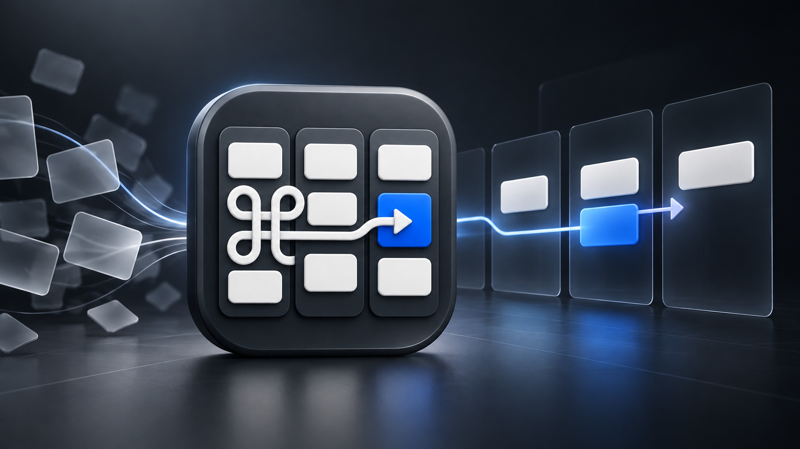

# CTRL KANB



CTRL KANB est une application macOS locale pour organiser et piloter des tâches avec **Codex** et **Claude Code**. Elle réunit un Kanban, un agenda, le suivi des résultats, les validations humaines et un espace de travail latéral avec chat, terminal et fichiers.

La version actuelle est une première version publique. Elle est conçue pour fonctionner sans serveur CTRL KANB ni compte propre à l’application.

## Fonctions principales

- plusieurs projets associés à des dossiers du Mac ;
- deux tableaux protégés : **Classique** pour les tâches ponctuelles et **Routines** pour les tâches récurrentes ;
- vue **Flux** pour les priorités, les tâches prêtes, les exécutions et les décisions en attente ;
- agenda Jour, Semaine et Mois avec fuseau horaire, premier jour de semaine et format 12/24 heures configurables ;
- historique, archivage réversible, restauration et suppression avec confirmation ;
- suivi des réponses et poursuite d’une conversation existante ;
- centre de validations pour les commandes, modifications de fichiers et questions des agents ;
- chat latéral Codex ou Claude Code avec choix du modèle, pièces jointes et conversations séparées ;
- terminal zsh et navigateur de fichiers limités au dossier sélectionné ;
- synchronisation explicite des conversations Codex et Claude Code ;
- comptes séparés par agent, sans copie des identifiants dans le tableau ;
- thèmes clairs et sombres, palettes de couleurs et taille de police réglable ;
- raccourcis macOS, palette de commandes avec `⌘ K` et panneaux redimensionnables ;
- planificateur macOS facultatif, livré désactivé.

## Prérequis

- macOS 14 Sonoma ou une version plus récente ;
- les outils de développement Apple en ligne de commande ;
- Codex et/ou Claude Code installés et connectés si vous souhaitez exécuter des tâches avec ces agents.

Installez les outils Apple si nécessaire :

```sh
xcode-select --install
```

Node.js 20 ou plus récent et Python 3 sont utiles pour le développement et les tests. Ils ne sont pas nécessaires pour utiliser une application déjà compilée.

## Installation depuis les sources

```sh
git clone <url-du-depot> ctrl-kanb
cd ctrl-kanb
./Scripts/install.sh
```

Le script compile l’application, exécute les contrôles disponibles, puis l’installe dans `/Applications`. Pour choisir une autre destination :

```sh
CTRL_KANB_INSTALL_DIR="$HOME/Applications" ./Scripts/install.sh
```

Pour compiler sans installer :

```sh
./Scripts/package_app.sh
open "dist/CTRL KANB.app"
```

L’application produite localement utilise une signature ad hoc. Une distribution binaire publique devra être signée avec un certificat Developer ID et notariée pour éviter les avertissements Gatekeeper.

## Première configuration

1. Ajoutez un projet et choisissez son dossier.
2. Ouvrez **Réglages → Agents et comptes**.
3. Vérifiez la disponibilité et la connexion de Codex et/ou Claude Code.
4. Choisissez l’agent utilisé par défaut et le niveau d’effort souhaité.
5. Créez une tâche dans **Classique** ou configurez une tâche dans **Routines**.

Un état **Connexion testée** signifie qu’un aller-retour réel a réussi à la date affichée. La synchronisation des conversations possède un état séparé pour Codex et Claude Code.

## Données et confidentialité

Les données de CTRL KANB restent dans :

```text
~/Library/Application Support/CTRL KANB/
```

Le dépôt ne contient pas ce dossier. Les identifiants Codex et Claude Code restent dans les dossiers gérés par leurs outils respectifs. CTRL KANB ne contient aucun service de télémétrie et ne stocke pas de clé d’API dans son tableau.

Une consigne envoyée à Codex ou Claude Code suit ensuite les règles de confidentialité du service choisi. Consultez [PRIVACY.md](PRIVACY.md) pour le détail des données locales, des échanges externes et des journaux.

## Développement

```sh
npm ci
npm test
npm run build
```

Les contrôles couvrent l’interface, les traductions, le câblage des actions, les injections HTML, les conversations, la synchronisation, les ponts natifs, les notifications et les données publiables.

Structure du dépôt :

```text
Resources/  Interface, icônes et ressources de marque
Scripts/    Construction, installation et contrôles
Sources/    Application macOS, helper et CLI
Tests/      Doubles de test et scénarios natifs
docs/       Architecture, modèle de données et revue UI
```

Documentation technique :

- [Architecture](docs/ARCHITECTURE.md)
- [Modèle de données](docs/DATA-MODEL.md)
- [Moteur macOS facultatif](docs/BACKGROUND-ENGINE.md)
- [Revue de l’interface](docs/UI-REVIEW.md)
- [Politique de sécurité](SECURITY.md)

## Limites connues

- le Mac doit être allumé pour lancer une tâche programmée ;
- les demandes de validation en cours ne survivent pas à l’arrêt du processus d’agent ;
- la signature ad hoc convient à une compilation locale, pas à une distribution binaire fluide ;
- les logos Codex et Claude Code restent la propriété de leurs détenteurs respectifs.

## Licence

Aucune licence open source n’est incluse pour le moment. Ajoutez une licence avant d’annoncer le projet comme logiciel libre ou d’accepter des contributions externes.
